# Programmatically Create Task Example

This project uses the AWS CDK to programmatically create an Amazon Connect Task. This example uses an incoming email to Amazon Workmail to create the Task and then responds to the customer via email as well. Once you deploy the stack, you can replace the email input and output with anything you like. For example, you can create a webform that triggers an API that invokes the Lambda function in this solution to create a task. This solution lays the ground work so that you can expand it to fit your needs.

 ## Description

 This code snippet is a sample implementation of an Amazon Connect Task workflow, which is initiated with a email from a contact, and ended with the a response email back to the contact. Below is a high-level flow of the implementation.

 1. A customer sends an email to an email address. In this implementation, this is either an Amazon Workmail address or address that is forwarded to an Amazon Workmail address.
 2. Workmail is setup with Inbound rule that triggers a Lambda function.
 3. The Lambda function in (2) above would call an Amazon Connect API to create a Task in your Amazon Connect instance that triggers a contact flow provided in this example.
 4. An agent will receive the incoming task on their agent CCP.
 5. The agent responds by creating a Task from the CCP, which would trigger the same contact flow.
 6. The contact flow triggers a Lambda function to send a response email back to the customer.
 7. The response is email is sent using Amazon SES, based on the information included in the Task and the contact attributes.

From the sample workflow above, you can customize and plug in your business logic as needed. Some of the possible customizations may include:

1. In step 2, you can embed a deep link to an email client app like Outlook, so that an Agent can click on it and type the response email in the app.
2. In step 2, you can have another trigger instead of Workmail, such as Inbound SES, or as a webform which would trigger a REST API in API Gateway.
3. In step 3, your Lambda function can have any logic to add information to the contact attributes on the task or you can integrate with an external CRM or database.
4. In step 4, you can integrate and add Task routing to an existing Contact Flow or any addtional logic as required.
5. In steps 5 and 6, you can use a custom CCP instead of a native CCP. You can have the agent responding to the task using that custom CCP (which would then invoke an REST API) instead of using the native CCP to create a task.
6. In step 7, you can notify the contact of the response, or progress along the way of the task using email or SMS (with Pinpoint service).
7. In steps 7 and 8, you can integrate another email service instead of Amazon SES or Workmail.

## Useful commands

The `cdk.json` file tells the CDK Toolkit how to execute your app.

 * `npm run build`   compile typescript to js
 * `npm run watch`   watch for changes and compile
 * `npm run test`    perform the jest unit tests
 * `cdk deploy`      deploy this stack to your default AWS account/region
 * `cdk diff`        compare deployed stack with current state
 * `cdk synth`       emits the synthesized CloudFormation template

## Prerequisites
1. You need to have an Amzon Connect instance configured and running. If you don't, you can create one by following the [instructions here](https://docs.aws.amazon.com/connect/latest/adminguide/amazon-connect-get-started.html)

 ## Deployment Steps
 1. Run `cdk init`
 2. Build the code with `npm install` (only run this the first time to install the npm packages) and then `npm run build`
 3. Get the instance arn of the Amazon Connect instance you want to use
    - The instance arn can be found when you view the intance details of your Amazon Connect instance in the AWS Console.
    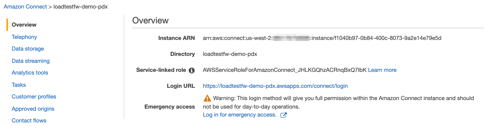
 4. Deploy the code by running this command and replacing the instance arn: `cdk deploy --parameters connectInstanceArn=<connect-instance-arn>`
    - get your <connect-instance-arn> which looks like this `arn:aws:connect:us-west-2:12345678901:instance/XXXXXX-XXXX-XXXX-XXXX-XXXXXXXXXXXX` 
    - Make sure to `aws configure` with the proper account, keys, and region before issuing the above command
    - After the commnand finishes successfully, you can go to https://console.aws.amazon.com/cloudformation, click on `AmazonConnectTasksCloudFormationTemplateStackTest`, then click on the `Resources` tab, you will see that the following resources have been deployed to your account. 
    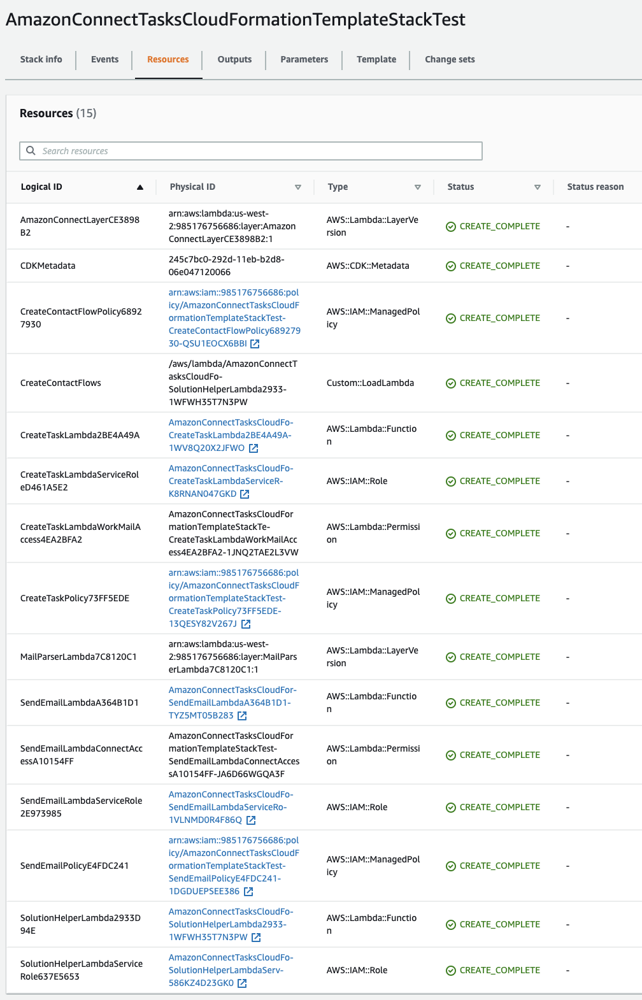
 5. Create a test Workmail organization.
    - Go to the [Workmail console](https://console.aws.amazon.com/workmail/) in the same region as your Amazon Connect instance.
    - Select "Create organization"
    - Select "Free test domain" for the email domain.
    - Enter a domain and alias.
    - You do not need to configure advanced settings.
    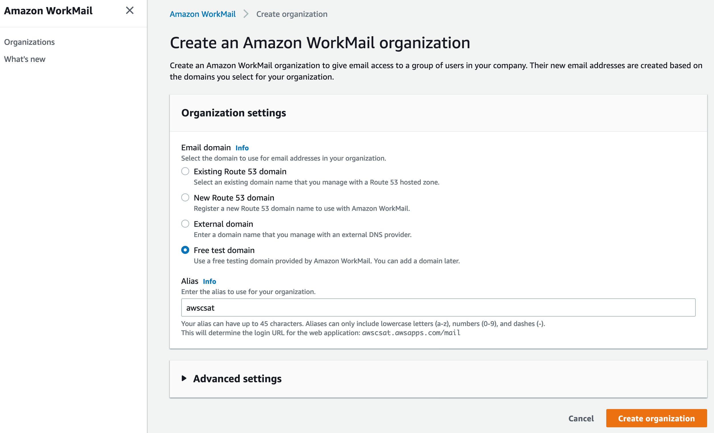
 6. Once created, go to your workmail domain and create a user.
    - Go to the organizations page and select the organization you just created.
    - Select "Create user"
    - Enter the username and create the user.
    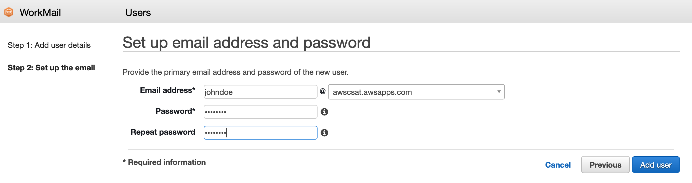
 7. Create a Workmail Inbound Rule to trigger a lambda to create task based on an incoming email.
    - Go to "Organization settings" 
    - Select "Inbound rules" and click "Create rule"
    
    - Select "Run Lambda" and copy and paste the Lambda arn of the CreatTaskLambda function from CloudFormation stack that was deployed
    - Enter the email you will send an email from in the "Sender domains" section.
    - Enter the email of the user you just created in the "Destination domains" section. 
    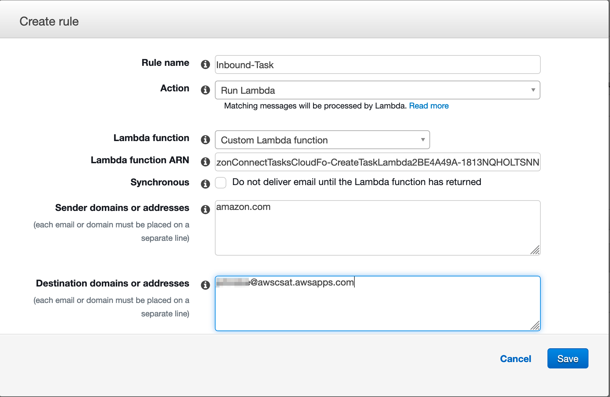
 8. Log into your Amazon Connect instance, navigate to the Routing profiles page, and create a new routing profile.
    - Enable tasks in the top section.
    - Add BasicQueue and enable Tasks. (If you choose to use another queue, you will need to modify the inbound task contact flow to set the appropriate queue).
    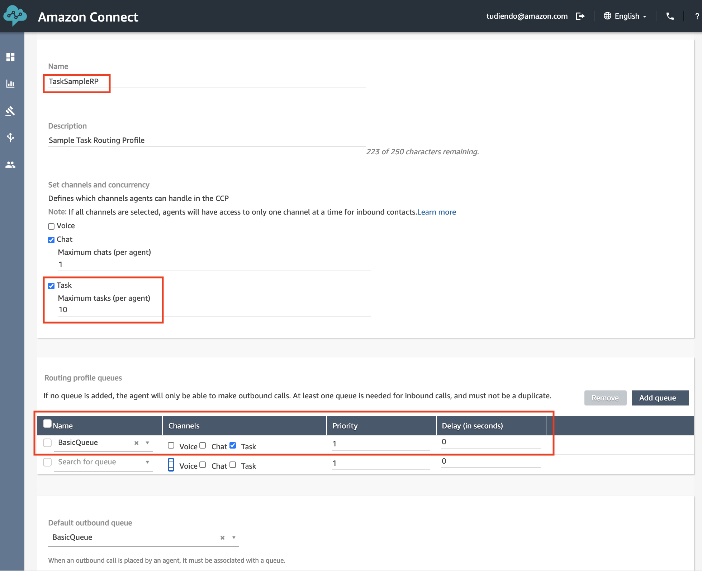
 9. Create a Quick Connect to enable the agent to create a task and assign it to a queue.
    - Navigate to the Quick connects page.
    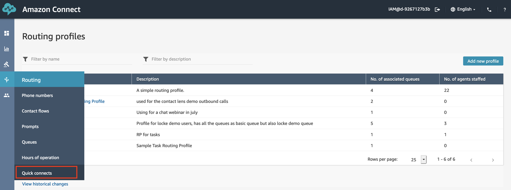
    - Click "Add new"
    - Give the quick connect a name, select "Queue" for the type, select "BasicQueue" for the queue, and select "Task Queue Transfer Flow" for the contact flow.
    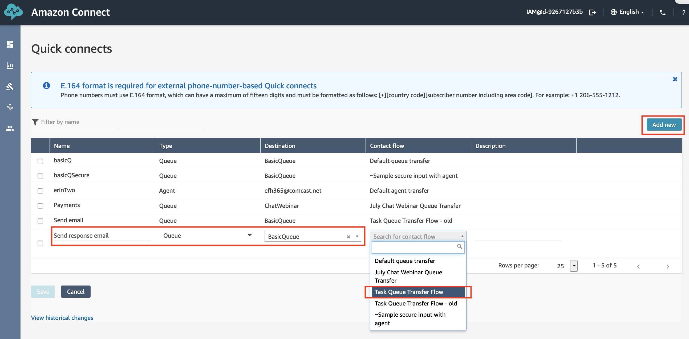
 10. Assign the quick connect to the queue.
    - Go to the Queues page
    - Open the Basic Queue and add the quick connect you just created.
    - Click save.
    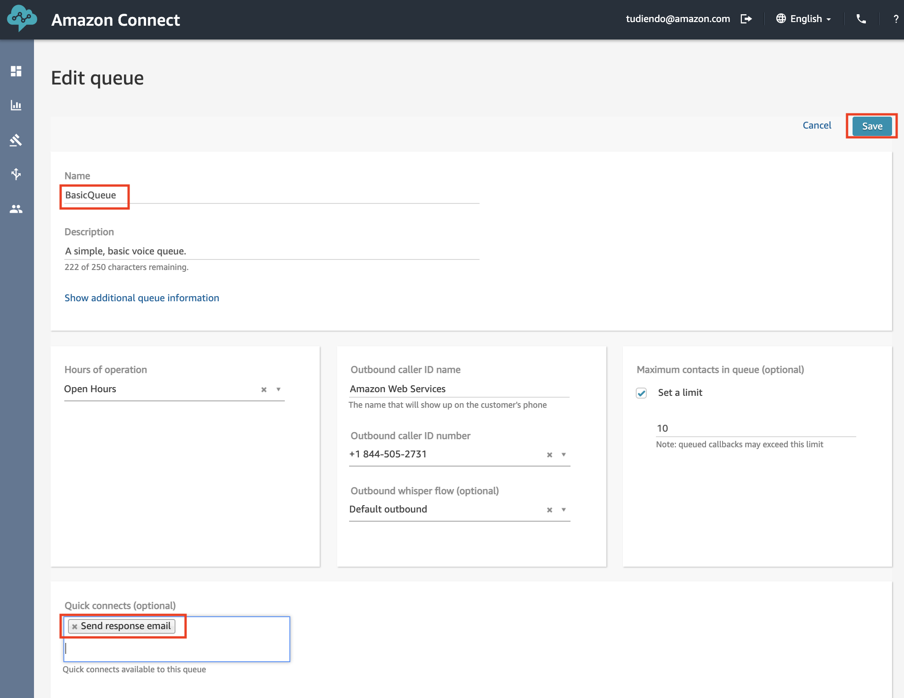
 11. Assign an agent to the tasks routing profile. 
    - Go to the User management page.
    - Edit a user and assign the task routing profile to the user.
    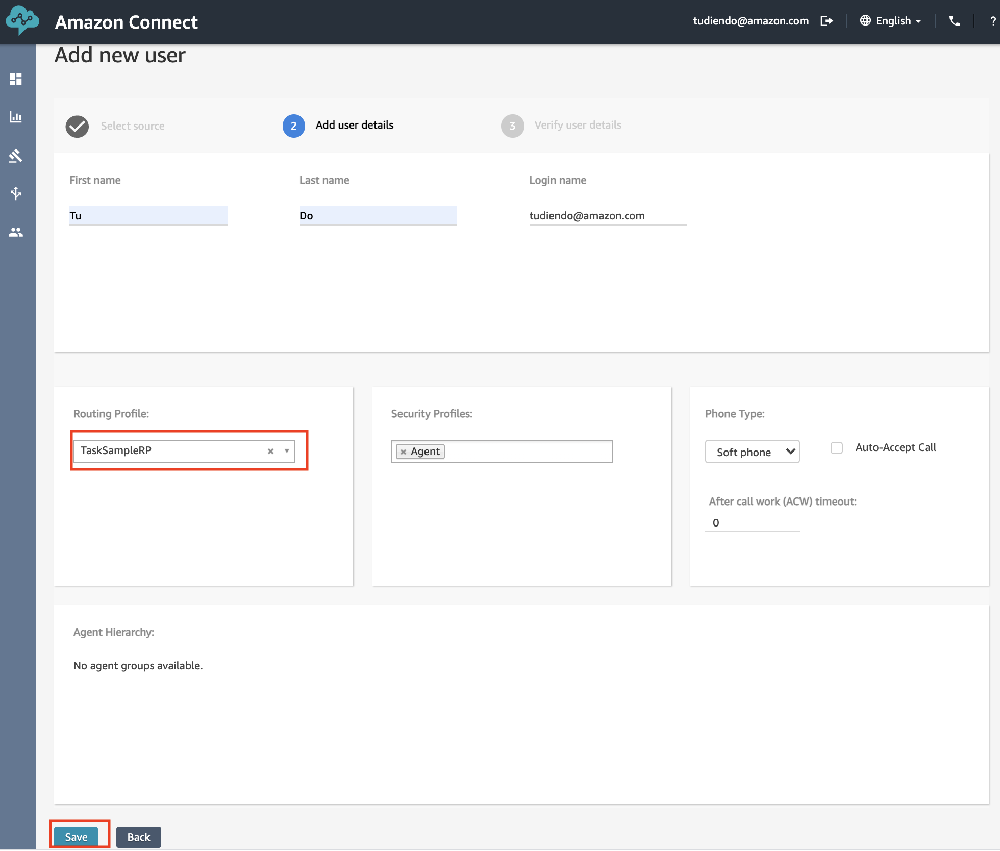
 12. Setting the Task Queue in the Contact flow.
    - Go to the Contact flow page
    - Select "Task Flow" and Edit
    - Drag a "Set working queue" block from the Set menue to the flow
    - Set the queue in step 10 (e.g. Basic Queue), and connect the block
    - Publish the Contact flow 
    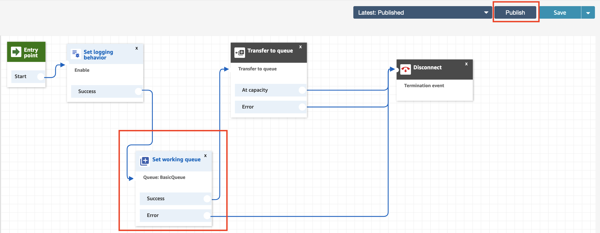
 13. Open the Contact Control Panel with your agent that is assigned the new routing profile.
   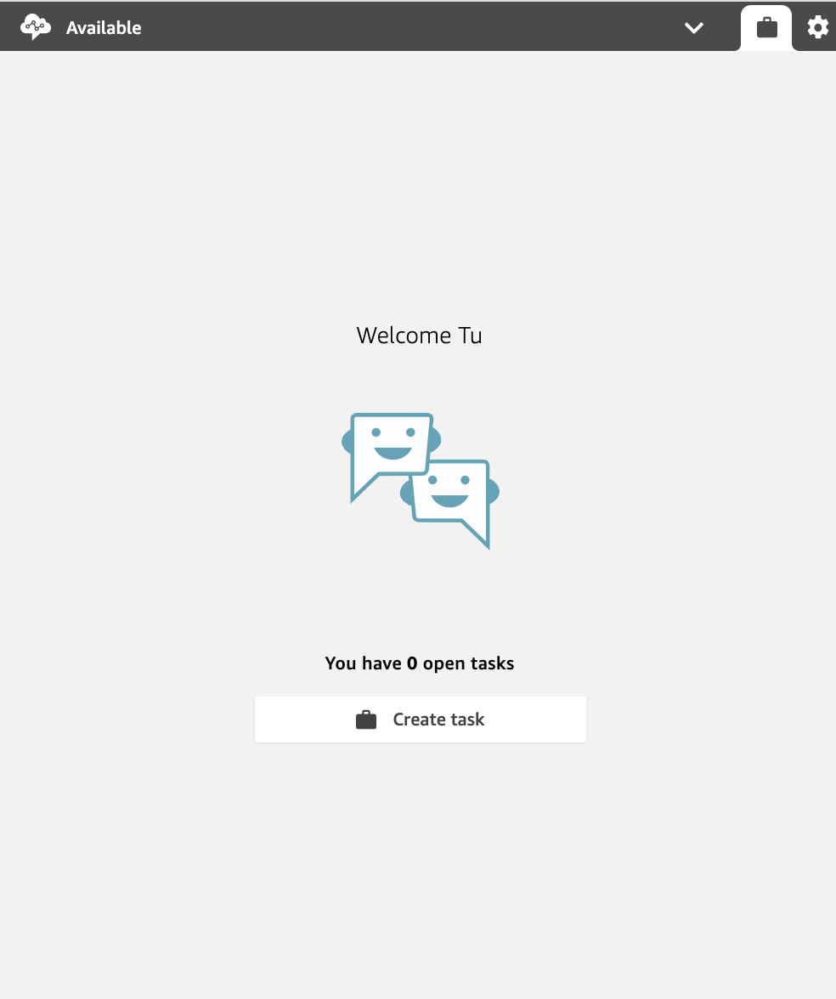
 14. Send an email to the user you created in your Workmail organization. 
 15. Your agent should receive a task once the email is received from Workmail.
   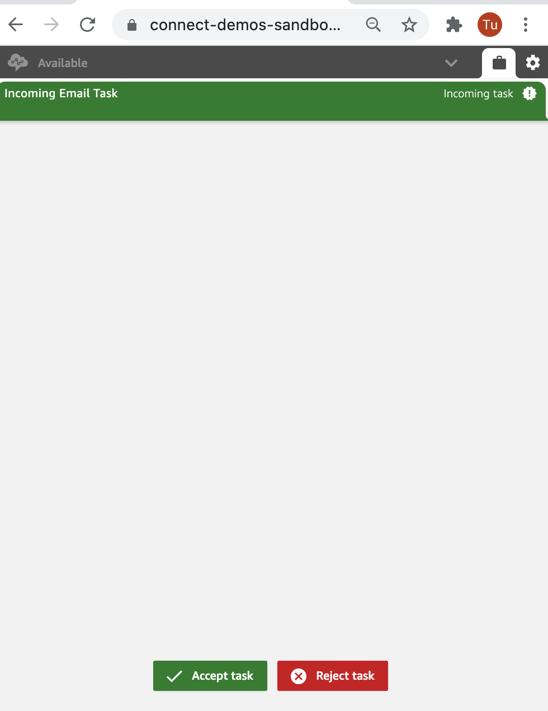
    - The agent will be able to see attributes like who the task is from, what they included in the email, etc.
    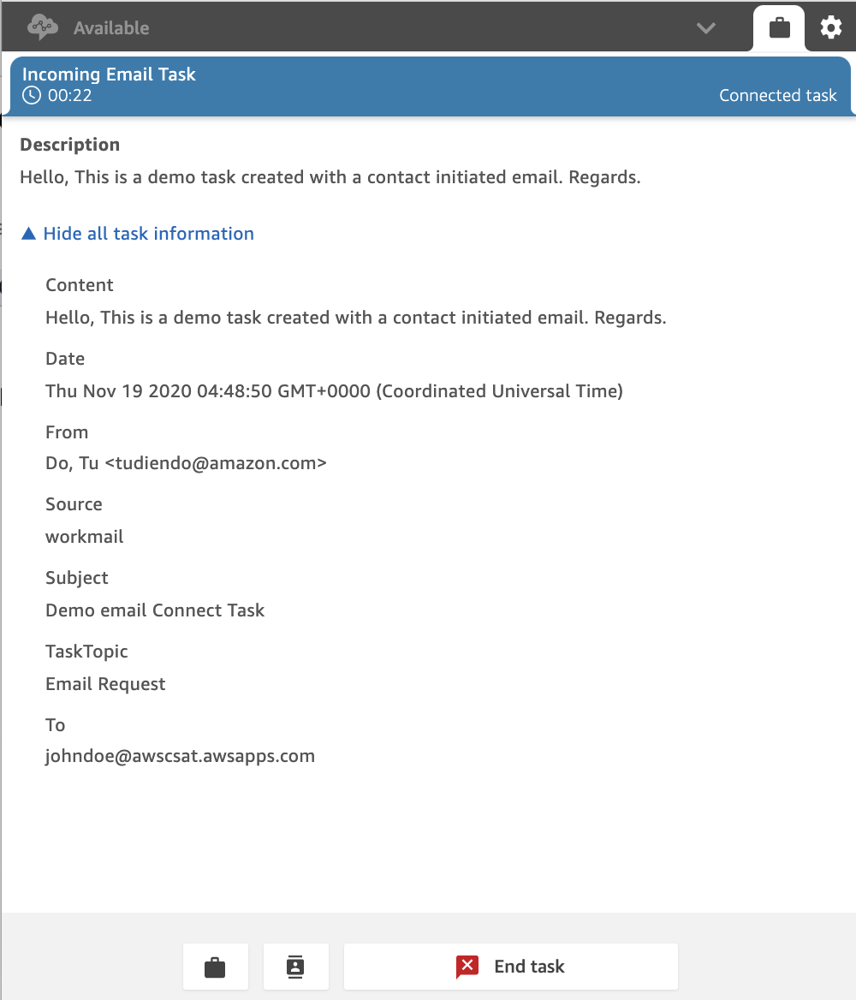
    - Note that tasks have a character limit in the description. (TODO: link to docs). Instead of including the email content in the task description, you could link to the email or link to a reference to it in your CRM.
 16. Next, click the suitcase item next to the end chat button to create a new task.
   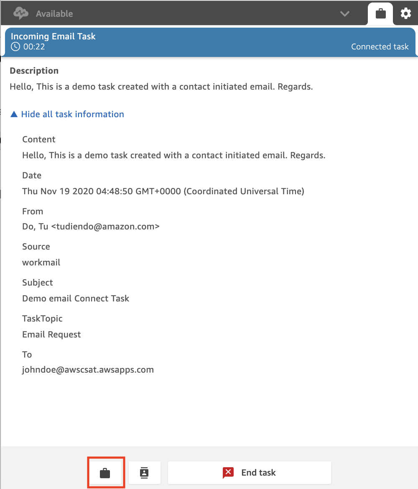
    - The Name field will be the subject of the email
    - The Description field will be the email content
    - Select the quick connect created in step 9
    - Click create task
    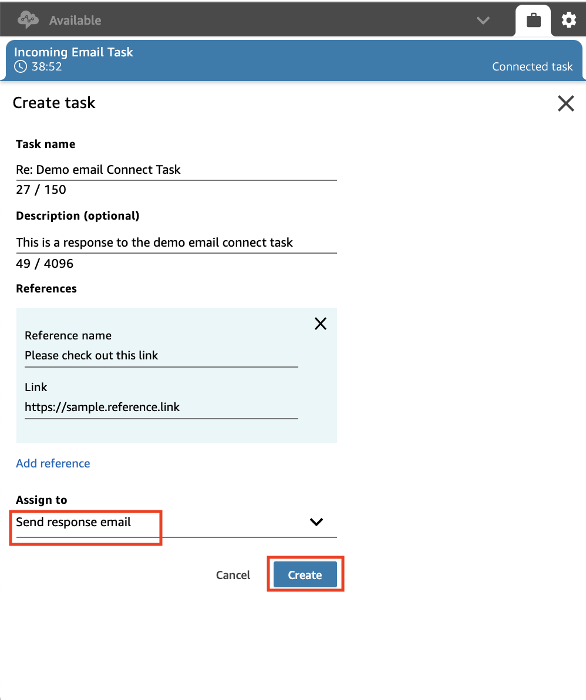
 17. You should receive an email with the contents of the task.
