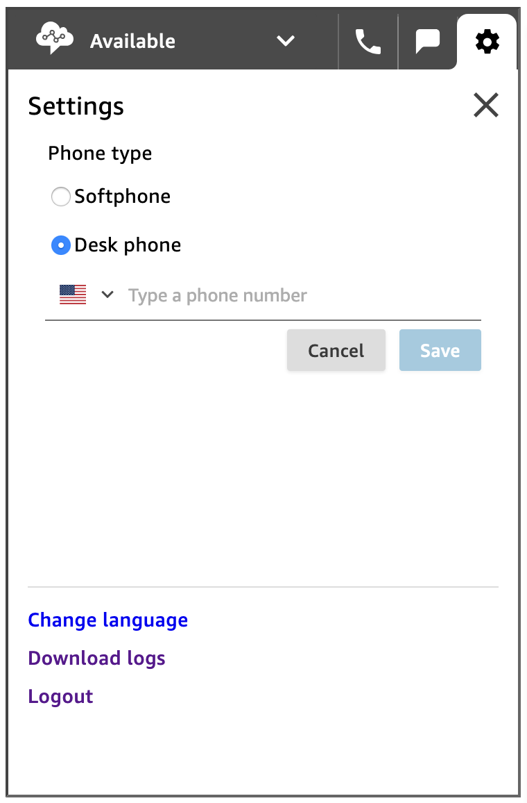
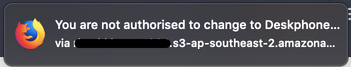

# Restrict Deskphone in CCP

Restrict Deskphone access from within CCP Settings

A sample code that shows how to restrict an agent from using a deskphone for taking calls while using a custom Amazon Connect CCP interface.

----

## Introduction
Agents use the Amazon Connect Contact Control Panel (CCP) to interact with customer contacts. It's how they receive calls, chat with contacts, transfer them to other agents, put them on hold, and perform other key tasks.

CCP, provides flexibility for agents to be able to receive customer calls on a desk phone instead of browser based built-in softphone. This feature is usually useful for agents who are working from remote locations and have low bandwidth connectivity to be able to take calls over the internet using the browser.

While this feature is very useful for the keeping the agents connected at a low bandwidth location, it also incur an extra cost for the outbound call being made. And hence, to avoid cost ,often there is a requirement from organisations to restrict agents from choosing deskphones as an option from the CCP settings.

In order to restrict the agent from choosing deskphone as an option, we need a custom CCP with some additional code that will be invoked each time agent tries to select the deskphone as an option. This code utilized the existing API connections and hence does not require any server side components such as API gateways or Lambda functions.

## Steps

Here are the high level steps involved:
* Deploy a custom CCP on S3 or web server of choice. Details [here](https://github.com/amazon-connect/amazon-connect-streams/blob/master/Documentation.md)
* Add the script provided in this example
* Ask agents to use this new URL to login into Connect

## Functioning
As soon as the agent tries to save an external deskphone number, an `agent.onRefresh` event is triggered and captured by the code that reverts the settings done and also notifies the agent.






```javascript

function handleAgentRefresh(agent) {
  var config = agent.getConfiguration();
  var x = config.softphoneEnabled;
  if (x === false) {
    config.extension = "";
    config.softphoneEnabled = true;
    agent.setConfiguration(config, {
      success: function() {browserNotify("You are not authorised to change to Deskphone. Softphone enabled again");},
      failure: function(err) {browserNotify("You are not authorised to change to Deskphone. Please revert back to the Softphone again");}
    });
  }
};

```

## Conclusion
The deskphone setting can be restricted by adding simple javasccript code into a custom CCP instance. This also avoids any server side setup such as API gateways, or Lambda functions. However, if your use case requires a more secure server side restriction of this setting, there is a solution available via Amazon Connect API.

> Work Hard, Have fun and Make History!
