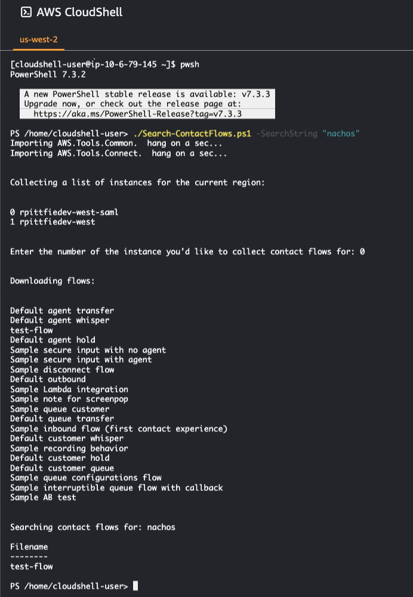

Downloads and searches Amazon Connect contact flows for a specified String.

CloudShell instructions:

1. Copy the script to CloudShell.
2. type in pwsh to start PowerShell
3. run the script: ./Search-ContactFlows.ps1 -SearchString "value"

Screenshot below shows sample usage in CloudShell:

Cloud9 instructions:

1. Install PowerShell using the instructions here:  https://learn.microsoft.com/en-us/powershell/scripting/install/install-other-linux?view=powershell-7.3
2. run PowerShell by typing pwsh on the shell and hitting enter.
3. Type in Install-Module AWS.Tools.Common and wait for that to complete.
4. Type in Install-Module AWS.Tools.Connect and wait for that to complete.
5. Save the contents of this file to your Cloud9 folder
6. run the script: ./Search-ContactFlows.ps1 -SearchString "value"
