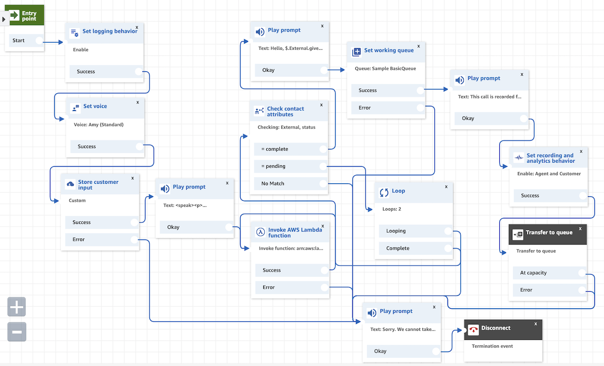
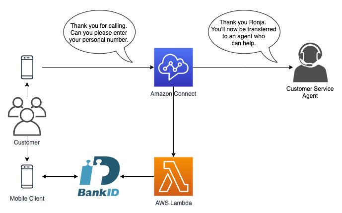

# Amazon Connect with BankID authentication
Securely identifying customers during an inbound call can be a legal requirement for many contact centers, especially in the financial industry. BankID is by far the largest electronic identification system in Sweden, with a current usage rate of 94% among smartphone users. With BankID, you get a stable and secure solution that the vast majority of your customers already use and trust.
With Amazon Connect, you can build high-quality omnichannel voice and interactive chat experiences to support your customers from anywhere.

This code will set up a contact flow/IVR for real time authentication with Mobile BankID and can be deployed in minutes.



Important: this application uses various AWS services and there are costs associated with these services after the Free Tier usage - please see the [AWS Pricing page](https://aws.amazon.com/pricing/) for details. You are responsible for any AWS costs incurred. No warranty is implied in this example.

### Services used
* [Amazon Connect](https://aws.amazon.com/connect/)
* [AWS Lambda](https://aws.amazon.com/connect/)



### Requirements for deployment
* An [Amazon account](https://aws.amazon.com/console/)
* An [Amazon Connect](https://docs.aws.amazon.com/connect/latest/adminguide/amazon-connect-get-started.html)
    * With a [claimed phone number](https://docs.aws.amazon.com/connect/latest/adminguide/claim-phone-number.html)
* Setup with [Test BankID](https://www.bankid.com/en/utvecklare/test)
* [AWS CLI](https://aws.amazon.com/cli/)
* [AWS SAM CLI v1.31.0+](https://docs.aws.amazon.com/serverless-application-model/latest/developerguide/serverless-sam-cli-install.html)

### Setup for Test BankID
1. Install test version of Security app to mobile device which is available in the [Test Documentation](https://www.bankid.com/en/utvecklare/test).
1. Order a personal code for the test server at [demo.bankid.com](https://demo.bankid.com/).
1. Login with code from the email.
1. Follow instructions at [demo.bankid.com](https://demo.bankid.com/) to issue your BankID for testing.
1. Review the latest [BankID Relying Party Guidelines](https://www.bankid.com/assets/bankid/rp/bankid-relying-party-guidelines-v3.6.pdf) to review the latest SSL Certificate information and passcode or to request custom production certificates.
1. _(optional)_ To update the certificates for your backend code you can find the latest download link in the [testing documentation](https://www.bankid.com/en/utvecklare/test).

_For more information on BankID integration, please review their documentation [here](https://www.bankid.com/en/utvecklare/guider)._

### Deployment
The Serverless Application Model Command Line Interface (SAM CLI) is an extension of the AWS CLI that adds functionality for building and testing Lambda applications.

In the terminal, use the SAM CLI guided deployment the first time you deploy.
```bash
# This command only needs run once. Once the pem files have been generated there's no need to run this again.
# This step can be modified if using new or private certificates with BankID
./get-latest-bankid-certificates.sh PASSPHRASE

sam build
sam deploy --guided
```

#### Choose options
You can choose the default options, however remember to pass in the Arn for your Amazon Connect instance or the deployment will not be sucessful.

```bash
## The name of the CloudFormation stack
Stack Name [sam-app]:

## The region you want to deploy in
AWS Region [eu-north-1]:

## The Arn of your existing Amazon Connect Instance
Parameter ConnectArn []:

## Shows you resources changes to be deployed and requires a 'Y' to initiate deploy
Confirm changes before deploy [y/N]:

## SAM needs permission to be able to create roles to connect to the resources in your template
Allow SAM CLI IAM role creation [Y/n]:

## Save your choice for later deployments
Save arguments to samconfig.toml [Y/n]:
```

SAM will then deploy the AWS CloudFormation stack to your AWS account.

### Call and test
Call your claimed number that you set up for the contact flow and follow instructions on the call.

You will be asked:
1. To enter your personal number. **This has to be a personal number you setup for Test BankID**
2. Open up your Test BankID app to identify yourself.
3. Congratulations! You have now authenticated yourself via BankID and will be greeted by your name.

## Cleanup
```bash
## Delete the stack via the SAM CLI
sam delete
```

## License
This library is licensed under the MIT-0 License. See the LICENSE file.