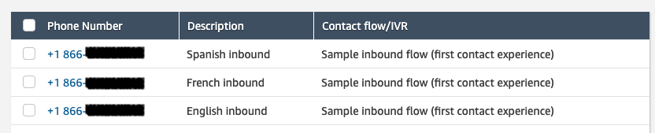

# Dynamic Attribute Routing

This project demonstrates how you can implement attribute based routing in combination with dynamic contact flow blocks to create a unique customer experience while using a small number of reusable and modular contact flows. Lambda is used to get attributes from various DynamoDB tables, temporarily storing them in memory as perpetual session attributes. This approach allows a large number of attributes to be referenced by various block types within numerous contact flows without the need to store any attributes in the CTR.

## Use case

Alpha to Zulu Corp distributes widgets across North America and has customers in the US, Canada and Mexico. They provide language specific numbers for customers to contact them and speak with a live agent. Each phone number routes to a specific language queue while playing prompts in that language

## Project Components
* CloudFormation template that builds:
  * IAM Role: Allows Lambda read/write access to Dynamo DB
  * Lambda Functions
    * Retrieve dynamic attributes from various tables
    * Init function to populate DynamoDB tables
  * DynamoDB Tables
    * Stores dynamic attributes for lambda functions, dialed numbers and prompts
* Amazon Connect Contact Flows
  * Init flow that sets customer experience and retrieves attributes from DynamoDB
  * Language flow that sets the correct voice and plays language specific introductory prompts
  * Main flow that sets the dynamic queue, performs hours/staffing checks and places the customer into queue
  
## Project Requirements
* Operational Amazon Connect instance
* Three (3) claimed inbound numbers
  * You will claim one inbound number for each language
  
* Three (3) unique queues
  * Make note of the ARN for each queue as you will need them when deploying the CloudFormation stack
  
  * Associate all the queues to an existing routing profile
  

## Deployment Steps
Perform the following steps to deploy this project: 
1. Create a new CloudFormation stack and upload template `dynamic-attribute-routing.yaml`
  * Make sure that you select the correct region to match your Amazon Connect instance
2. Name your stack and enter all the parameters listed with details from your Amazon Connect instance
  * Take note of the `DeploymentEnvironment` you select
  * Make sure you enter enter the correct phone number mapping and queue ARNs you noted previously
  
3. Click `Next`, select the IAM resource disclaimer and click `Create Stack`
4. Once the stack creation has completed, add the `~GetLambdas`, `~GetDynAttributes`, and `~GetPrompts` Lambda functions to your Amazon Connect instance.
  
5. Download the three contact flows in the ContactFlows directory.
6. Import them in the order listed below. Save and Publish each contact flow after import while making the edits as indicated below:
  * (MAIN FLOW) `100_MainFlow` - Publish as-is
  * (LANGUAGE FLOW) `100_LangFlow` - Publish as-is
  * (INIT FLOW) `100_InitFlow` - Select the first Invoke AWS Lambda Function block and change it to the GetLambdasFunction that you enabled previously (in step 2). In the same block, set the value for the `environment` key to the same environment as the CloudFormation stack.
  
7. Open your `Default customer queue` contact flow and edit the Loop Prompt block. Remove the default queue hold message. Keeping this message will create is disjointed caller experience for non-english calls.
  * Don't forget to `Save` and `Publish` the flow after making changes
  
8. Set the set the `100_InitFlow` as the contact flow for all three phone numbers in your instance.
  
9. Wait ~ 2 min for everything to update.

## Validation
To validate everything is working as expected, perform the following steps:

### Hours of operation and Agent status checks
In addition to the operation hours you configured for the three queues, this contact routing also checks for staffed agents. To test the after hours (closed) treatment, perform all the tests listed below with all agents in "Offline" status.

### Test first language number
1. Call the first phone number that you assigned for English
2. Listen to the prompts and verify they play correctly
3. View the real-time metrics and verify the call was placed in the correct queue
4. Hang up. 

### Test additional languages 
Follow the same steps listed above to test additional languages. Each number should playback the appropriate language-specific prompts and place the call in the correct queue.

## Conclusion
Now that you have the foundation in place for attribute-based dynamic routing the possibilites are endless. Utilizing session attributes allows you to keep your CTR records clean and only write the attributes you want while keeping the others in memory to perform various tasks throughout the contact.

  