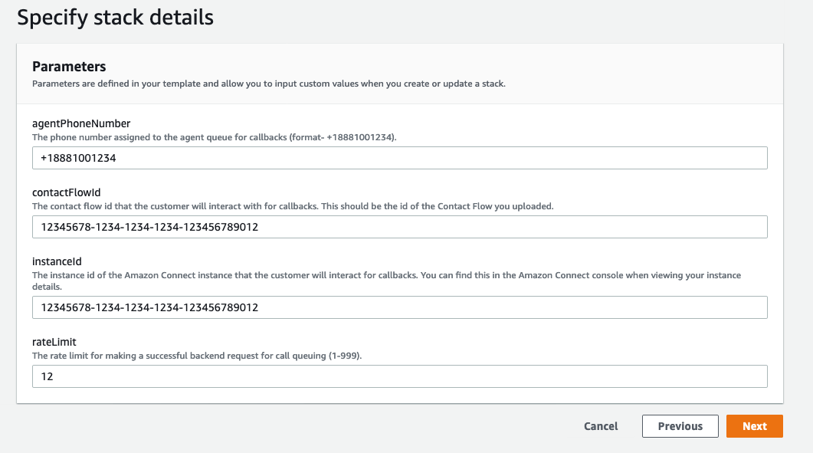
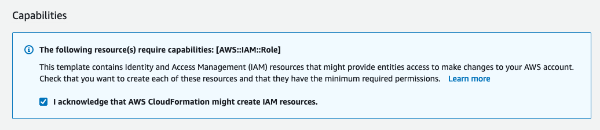
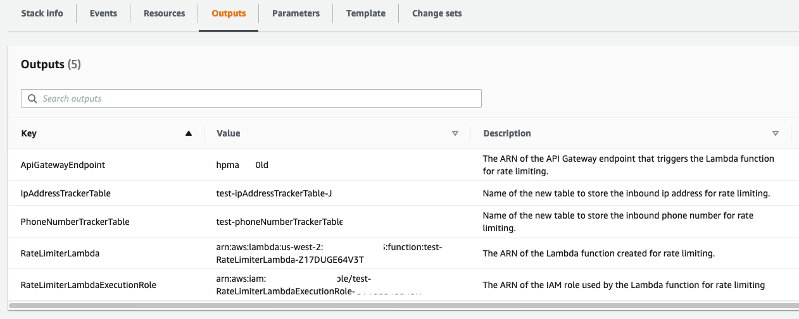
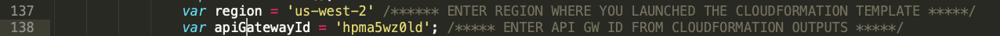
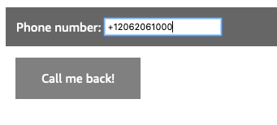
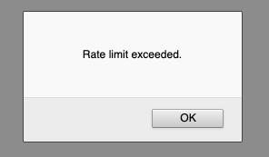

# Rate Limiter for Amazon Connect

The rate limiter project utilizes AWS Lambda and Amazon DynamoDB dynamically to add rate limiting a caller to a queue based on their phone number and/or IP address. For eg. a caller making more than 10 requests to be added to the queue will be blocked. This example blocks any caller from making requests from the same phone number or IP address based on a **configurable rate limit**. 

# Deployment
1. Launch the Amazon Cloudformation template `rate_limiter_cfn.yml`.
2. In the parameters section, enter the following information: 

3. Click Next twice, and on the `Review test` page, check the `IAM_CAPABILITY` checkbox. 

4. Click `Create Stack`.
5. In the `Outputs` tab, note down the `ApiGatewayEndpoint` value.


# Testing
1. This repo contains an `index.html` file for testing
2. Before you begin testing, edit the `index.html` using a text editor of your preference. 
3. On line 137, enter the region where you deployed your AWS CloudFormation template. 
4. On line 138, enter the `apiGatewayId` from step 5 in the previous section.

5. Once complete, save your `index.html`, and open it in any browser.
6. You should see the following homepage:

7. For successful requests, you will receive the following message:

8. Once you hit the rate limit, you will receive the following message:


_Note_: This code does not readily integrate with Amazon Connect, you can add to this sample according to your use case.

# Add code for Amazon Connect Integration
1. Navigate to the Amazon Lambda service, and click the `RateLimiterLambda` function created during deployment.
2. Uncomment `//startOutboundCall(phoneNumber);` under `//CALLBACK BLOCK`.
3. At the end of the lambda function, insert the following lines of code.
```
startOutboundCall = async (phoneNumber) => {
    let params = {
        ContactFlowId: process.env.CONTACT_FLOW_ID,
        DestinationPhoneNumber: phoneNumber, 
        InstanceId: process.env.INSTANCE_ID,
        SourcePhoneNumber: process.env.INSTANCE_ID //phone number for outbound - attached to the queue assigned to the routing profile assigned to the agents
    };
    var response = await connect.startOutboundVoiceContact(params, function (err, data) {
        if (err) console.log(err, err.stack); // an error occurred
        else console.log(data); // successful response
    });
    return response;
}
```
4. This will make an API call to the startOutboundVoiceContact method for Amazon Connect with the parameters you provided during deployment.