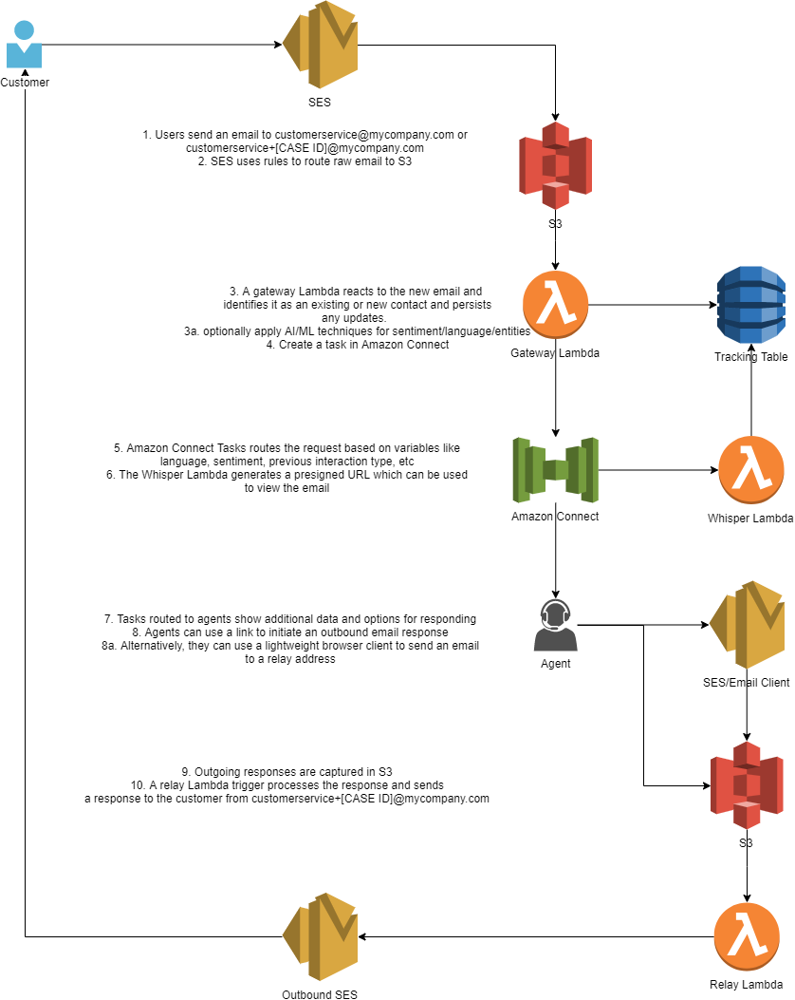

## Simple Email for Amazon Connect

Leverage Amazon Connect Tasks to build an email channel for Amazon Connect.  The solution leverages Amazon SES to send and receive emails.  Using a serverless architecture, inbound emails are logged and routed to Amazon Connect as a Task.  Agents can receive and respond to emails using a native email client via a custom CCP.  Outgoing emails are recorded and tagged to a particular case ID enabling return conversations.

## License Summary
This library is licensed under the MIT-0 License. See the LICENSE file.

## Setup process
This package requires AWS Serverless Application Model (AWS SAM) Command Line Interface (CLI) to deploy to your account. Instructions for installing and setting up SAM CLI can be found here: https://aws.amazon.com/serverless/sam/

## Prerequisites
To use Amazon SES for receiving email messages, you need to verify a domain that you own. Refer to the documentation to verify your domain with Amazon SES console. If you do not have a domain name, you can register one from Amazon Route 53.

You will also need an Amazon Connect instance.  For directions on how to launch Amazon Connect, refer to the documentation.

## Installing dependencies
Use npm install in the email-gateway-lambda and email-relay-lambda directories to install any required packages prior to packaging and deploying this SAM application.

## Deployment
1. Import the following Contact Flows:
   1. Agent Whisper:  email-AgentWhisper
   2. Customer Queue: email-CustomerQueue
   3. Transfer to Queue: email-QueueTransfer
   4. Contact Flow: email-Inbound

Note, there will be empty references to lambda functions that will be added later.
Take note of the ARN for the email-Inbound Contact Flow
2. Deploy or identify an Amazon S3 bucket where we can upload our Lambda functions packaged as ZIP before we deploy anything - If you don't have a S3 bucket to store code artifacts then this is a good time to create one:
~~~
aws s3 mb s3://BUCKET_NAME
~~~
Next, run the following command to package our Lambda functions to S3:
~~~
sam package \
    --template-file template.yaml \
    --output-template-file output_template.yaml \
    --s3-bucket REPLACE_THIS_WITH_YOUR_S3_BUCKET_NAME
~~~
3. Deploy the SAM template
Next, the following command will walk through the parameters and create a Cloudformation Stack and deploy your SAM resources.
~~~
sam deploy --guided
~~~    
The guided deployment will ask for the following parameters:
   1. Stack Name: The name of the Cloudformation Stack
   2. AWS Region: The region for the stack to be deployed in.  The region should support Amazon Connect and Amazon SES
   3. GeneralInquiryEmailAddress: The inbound email address you'd like to use for generic inbound emails
   4. InquiryEmailAddressDomain: The domain address starting with @ of the General Inquiry Email Address
   5. AmazonConnectInstanceArn: The ARN of your Amazon Connect instance
   6. AmazonConnectTaskContactFlowId: The ARN of the email-Inbound contact flow.  Hint: The Instance ARN is everying before the /contact-flow/ in your Contact Flow ARN
   7. EmailAccessTimeout: How often the access URL for emails is refreshed
   8. EnableLanguageDetection: TRUE/FALSE Determine whether to detect the language of an email
   9. EnableSentimentDetection: TRUE/FALSE Determine whether to detect the sentiment of an email
   10. EnableEntityRecognition: TRUE/FALSE Determine whether to detect the key phrases of an email
   11. EmailDisclaimer: Text that is added after any email response

See Serverless Application Model (SAM) HOWTO Guide for more details in how to get started.

Take note of the S3 Bucket name created from the stack as well as the Lambda function names.

4. Add Amazon S3 Triggers to invoke actions on inbound and outbound emails
   1. Navigate to the EmailGatewayFunction inside of the AWS Lambda Console
   2. In the function overview, click "Add trigger"
   3. Select S3, and then select your new S3 bucket from the drop down
   4. Add a prefix for "inbound/"
   5. Select the Recursive invocation acknowledgement and select Add
   6. Navigate to the EmailRelayFunction inside of the AWS Lambda Console
   2. In the function overview, click "Add trigger"
   3. Select S3, and then select your new S3 bucket from the drop down
   4. Add a prefix for "relay/"
   5. Select the Recursive invocation acknowledgement and select Add
5. Add the ConnectGenerateURLLambda and ConnectWhisperFlowLambda Lambda functions to your Amazon Connect Instance
   1. Navigate to the Amazon Connect service console
   2. Select the alias of the target instance
   3. Navigate to Contact Flows on the left hand menu
   4. Under AWS Lambda select and add the ConnectGenerateURLLambda and ConnectWhisperFlowLambda Lambda functions
6. Update your contact flows
   1. email-Inbound
      1. Update the Invoke AWS Lambda block to ConnectGenerateURLLambda
   2. email-CustomerQueue
      1. Update the Invoke AWS Lambda block to ConnectGenerateURLLambda
   3. email-AgentWhisper
      1. Update the Invoke AWS Lambda block to ConnectWhisperFlowLambda
   4. email-QueueTransfer
      1. Update the Invoke AWS Lambda block to ConnectGenerateURLLambda
7. Create Amazon SES Relay Rule 
   1. Navigate to the Amazon SES service console
   2. Under Email Receiving on the left hand menu, select Rule Sets
   3. Select View Active Rule Sets (Or create a new one)
   4. Add the following as recipients
      1. agentrelay@yourdomain.com
      2. queuerelay@yourdomain.com
      3. rejectrelay@yourdomain.com
      4. relay@yourdomain.com
   5. Add an S3 Action
      1. Select your inbox bucket as your S3 Bucket
      2. Set the object key prefix to "relay/"
      3. Optionally encrypt
      4. Leave the SNS topic to <None>
   6. Add a Stop Rule Set Action
      1. Set the SNS topic to <None>
   7. Select Next Step
   8. Name the rule "relay-rule"
   9. Select the Rule Set
   10. Insert after rule <Beginning>
   11. Select next step, review and create
8.  Create Amazon SES Inbound Rule 
   1. Navigate to the Amazon SES service console
   2. Under Email Receiving on the left hand menu, select Rule Sets
   3. Select View Active Rule Sets (Or create a new one)
   4. Add your inquiry address i.e. customerservice@yourdomain.com
   5. Add an S3 Action
      1. Select your inbox bucket as your S3 Bucket
      2. Set the object key prefix to "inbound/"
      3. Optionally encrypt
      4. Leave the SNS topic to <None>
   6. Add a Stop Rule Set Action
      1. Set the SNS topic to <None>
   7. Select Next Step
   8. Name the rule "inbound-rule"
   9. Select the Rule Set
   10. Insert after rule "relay-rule"
   11. Select next step, review and create
9.  Upload the email-ccp to a static website
10. Whitelist the  domain for Connect
11. Login as an agent to your email-ccp and send an email to your inquiry line

## Workflow

As emails come in, they will be deposited into the newly create S3 bucket. The Email Gateway Lambda function will be triggered.  The function will read the email and parse the email's contents.  

The Gateway function starts by looking for spam flags in the SES response.  If any are triggered, the function will return and no action will be taken on the email.  If not, a copy of the email is stored in the inboundemails directory with the .eml file identifier.  The original email body will be formatted to remove header information and then run through the ML services as configured.  Note that Language Detection must be enabled for the other features to work.  Otherwise, this can be hardcoded to default to a language.

The TO address is then interpretted to determine if the email has an associated case identifier.  If no, one is created and the target for the task is set to the general inquiry line.  If yes, the information is pulled from DynamoDB and mapped to appropriate configuration.

The interaction ID associated to the email is used to track the conversation on the backend, but also acts as an alias for the reply to email.  For example, outbound communications from customerservice@domain.com with be sent from customerservice+[CASE ID]@domain.com.  Emails sent to that address will be mapped back to that case.

The formatted email document with ML results is then stored in the formatted/ S3 directory as a JSON object so that the agent ccp can interpret the results.

The interaction record is then updated with the latest information, the Task is created on Connect, and the record is persisted back to DynamoDB with an INBOUND_EMAIL interaction snapshot in it's history attribute.

Once the Task is created, it lands in the email-Inbound flow.  Using the target_type and target_destination attributes, the task is routed to the appropriate agent or to the appropriate queue.  Additional routing options can be added to take advantage of detected language, sentiment, or otherwise.

Before being routed to queue, the Connect Generate URL Lambda is invoked.  This Lambda creates two presigned urls:  one for the formatted email object and one for the email in the inboundemail/ directory.  The former is saved as a contact attribute and the latter is saved as a reference.  The function also returns the set expiry time of the presigned url (less one minute) which is saved as an attribute before the Task is routed to queue.

The email-CustomerQueue flow loops the Task through the flow every time to refresh the urls based on the expiry time so that they are still valid when routed to an agent.

When an agent accepts the email, the Connect Whisper Flow Lambda perists information to the interaction record to show that the Task has been routed to a particular agent on the current queue.

The CCP will pick up on the current presigned url of the formatted email and populate with the relevant information like sentiment, language, as well as the email body.  The agent will also be presented with 4 URL links.  These links will open the default mail client and populate the To address with the appropriate relay email address.

Agents have the option to return all responses to the default option, send returns back to the current queue, send returns to themselves, or reject the email (i.e. if no further communication is necessary).  The agent will draft the response and send it from their default mail client.  The relay email will contain the alias for the interaction record.

If agents need to view the original email, they can download it using the Reference link.  However they should be instructed to not reply to this email as that will break the interaction history and expose their personal email address.

Agents can also transfer the call to another queue using a Quick Connect so long as the transfer flow contains the same logic detailed in the email-QueueTransfer Contact Flow.

When an agent replies, the relay-rule is invoked and stores the response in the relay/ directory of the S3 bucket and the Email Relay Lambda is invoked.

The relay lambda inspects the outbound email, determines the relay type, and updates the interaction record based on relay address.  The outbound email will be prepended to the latest inbound email and sent via SES from the inbound email + interaction ID address.  The interaction record is then persisted back to DynamoDB with the details of the response.

## Security

See [CONTRIBUTING](CONTRIBUTING.md#security-issue-notifications) for more information.

