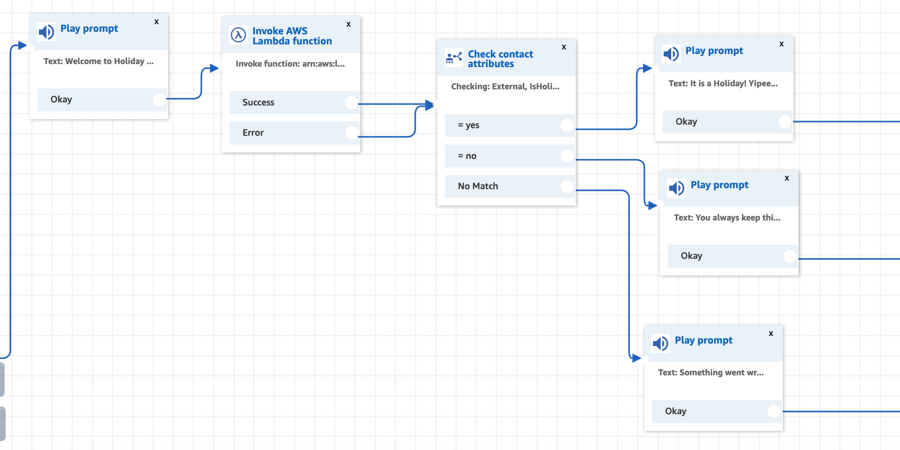
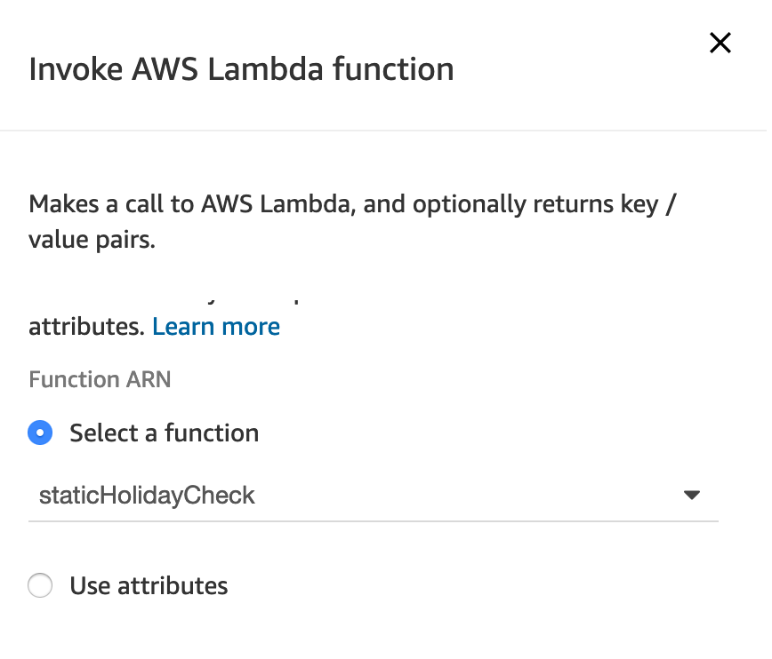
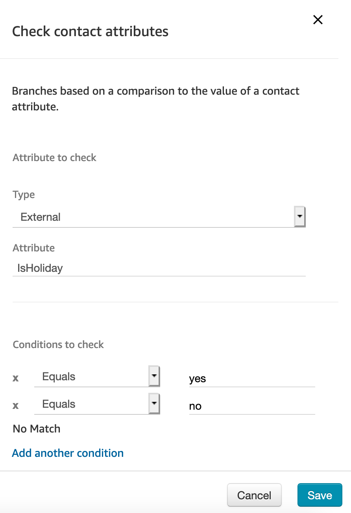
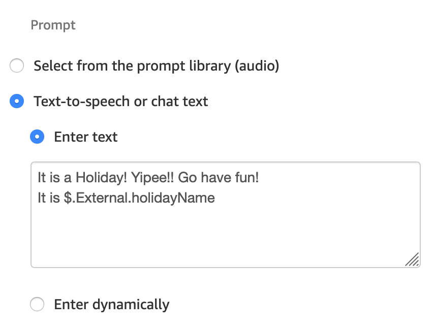

# Holiday check with Amazon Connect - Static value

A very common ask from contact centres is to be able to perform holiday check from within their contact flows and direct the call flow accordingly.

This sample code that shows how to add a basic, simple, very static method of adding the functionality to the Amazon Connect contact flows. It also allows you to store holiday names that can be spoken to the caller using Text to speech.

----

## Introduction
Holiday checks for a realtime application such as an IVR flow can be pretty elaborate task with a database, an administrator front end to manage it or even an internet based web service that provides lot of options for implementations.

Amazon Connect is powerful enough to cater to all such needs, if that's what the organisation's use case requires.

However, in a smaller environments, there mostly is no need of a database or an administrator's front end for setting holidays. Just a manual entry once a year that sets the calendar for the whole year. And also support an ad-hoc manual entry for holiday announcements.

This example does exactly this. It helps you create a Lambda function that allows to set the year's holidays manually. Then from within the Amazon Connect contact flows, call this Lambda function to verify today's day as a holiday.

This Lambda function is written in Python and requires some basic understanding of the AWS console.

## Steps

Here are the high level steps involved:
* Create a new Lambda function within your AWS account
  * Set the runtime as Python 3.8 or above
  * Assign the role that has basic Lambda execution permissions
  * Copy the code provided in this example as Lambda body and save
* Add [this](lambda_function.py) new Lambda function to your Amazon Connect instance from the properties
* Invoke the Lambda from your contact flow

## Contact Flow

After creating the Lambda and adding the same in the properties of the Connect instance, we can use the same from within the contact flows at appropriate part of the flow.

* Invoke the Lambda function:



----



* Then using the Check Contact Attributes, branch out based on the response from Lambda whether it's a holiday or not. This sample Lambda function returns two values that can be used within the Contact Flow - `IsHoliday` and `holidayName`.

* If today's date is a holiday, the value of `IsHoliday` will be 'yes' else it will be 'no'



* The second value `holidayName` contains the name of the holiday, such as, 'Christmas Day'. You can use this value within the play blocks by adding `$.External.holidayName` within the text you want to play.




## Lambda Code

The Lambda code has a static list of holidays that needs to be updated atleast once a year by the administrator. It is stored a variable within the Python code.

```python

holidayList = {
    "25/12/2020": "Christmas Day",
    "01/01/2020": "New Year Day",
    "27/01/2020": "Australia Day",
    "10/04/2020": "Good Friday",
    "01/06/2020": "Awesome Day"
}

```
Make sure you update the list in exact same manner as shown in the example above.

For the complete code for the Lambda function, please refer to [this](lambda_function.py) file in this repo.

## Conclusion

For a simple holiday check, we can use the serverless Lambda functions to store and validate holidays for our contact flows. With very basic system administration, the list of holidays can be updated.


> Work Hard, Have fun and Make History!
