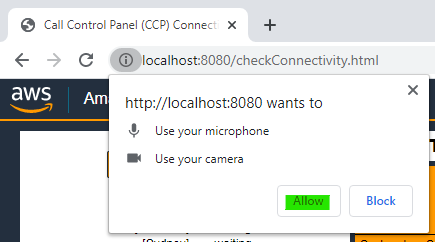
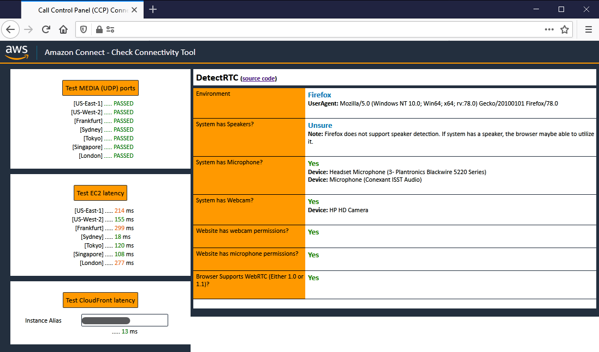
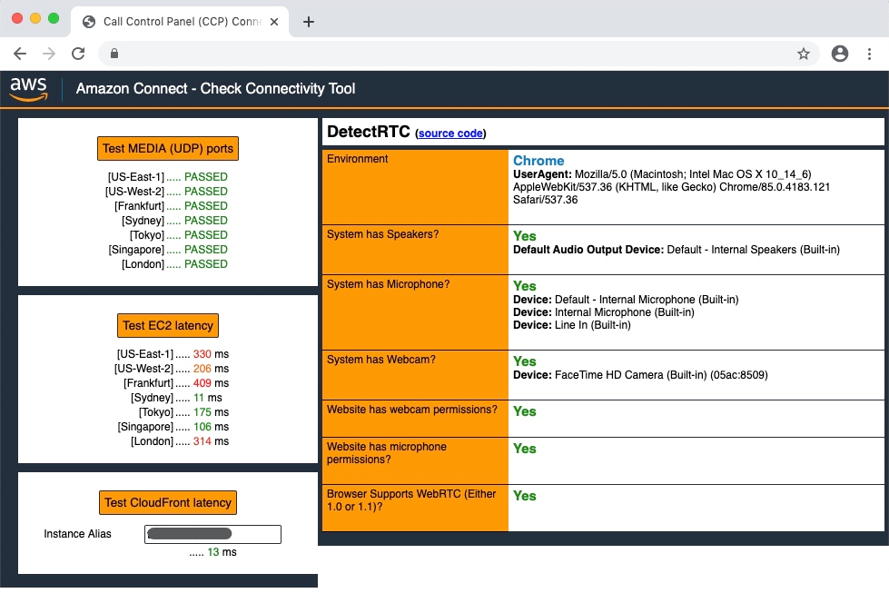
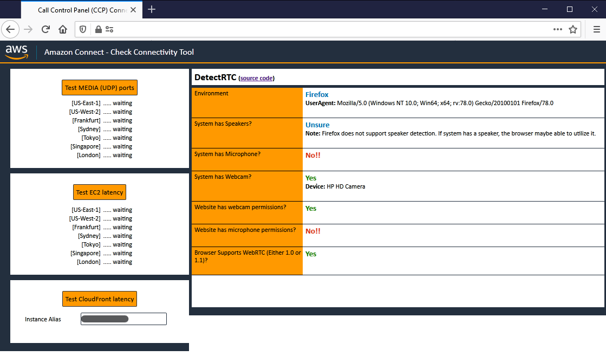
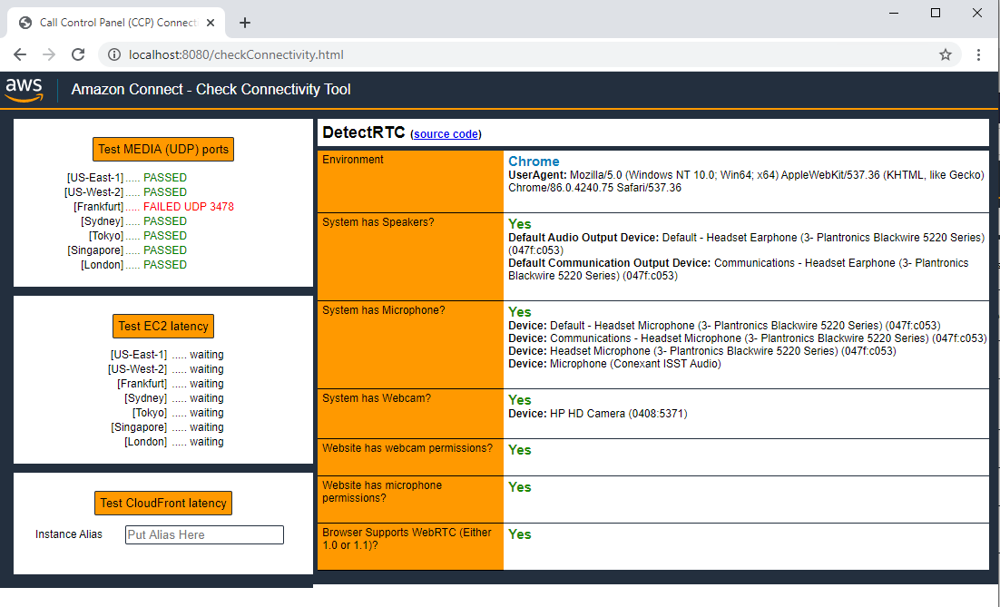
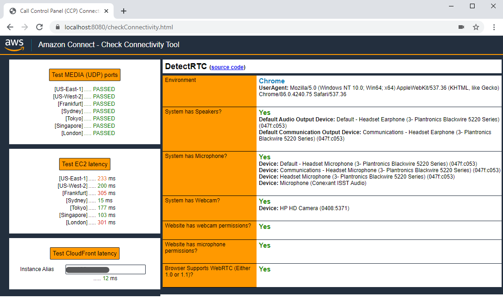

# How this tool works?

Amazon Connect leverages the modern browser's media capability to deliver an easy-to-use omni-channel soft phone with superior voice quality. However, as the quality of the internet access is vastly different between users, sometimes the experience of individual agent can be affected by many different factors. This tool will mimic the API calls used by Amazon Connect’s Contact Control Panel (CCP) to determine if the end user meets the basic requirements for making successful calls using CCP.

# Use this tool now:
The easiest way to use the tool is to visit our S3 bucket link to use it directly without deploying it:

https://connectivitytest.s3.amazonaws.com/checkConnectivity.html

# How to use this tool
When the page loaded for the first time, it will ask you to provide the necessary permissions. Please allow the tool to access your devices by clicking __Allow__ when prompted by your browser. No data would be sent to us in the process.



After the permission is granted, the right part of the page (Detect RTC) should be populated automatically.

After the page finished loading, please press the top 2 buttons on the left first and wait the results to populate:
* Test MEDIA (UDP) ports
* Test EC2 latency

Then, put the instance alias into the text input at the lower left part of the page which says Put Alias Here.

For example, if your Amazon Connect CCP’s link is `https://testing.awsapps.com/connect/ccp-v2/`, put `testing` in this textbox.

Then press the button of __Test CloudFront latency__ and wait for the result to populate.
Note: if the Instance alias is provided incorrectly, an error message would be displayed. Please make sure to remove any surrounding white spaces.

# “AWS Support asked me to do the test”
In this case, please make sure to test everything mentioned above correctly and wait the results to be finalized before taking a screenshot. Also, please include everything on the page and don’t left out any information behind.

A good test result screenshot example would look like one of the following. When you take the screenshots for the test results, please take screenshots like those examples. Please include the instance alias when you send the test result screenshot to AWS Support.

Following screenshot showed a full test example under Windows with FireFox 78:


Another screenshot showed a full test example under MacOS with Chrome 85:


# How to interpret the results
## Detect RTC results:

For the Detect RTC panel, result of green __Yes__ means positive and it means this browser meets / exceeds the requirement for using CCP for that specific requirement; If your browser / system did not meet a specific requirement for CCP, and the tool had detected this, it will warn you with a red __No!!__ on that requirement. __Blue__ result means this result is either informational or the tool cannot detect it.

The screenshot below showed an example of the tool running in a system without a microphone.


## UDP ports
This section of the tool would test the connectivity from the agent’s browser to Amazon Connect’s voice media servers. In [AWS IP Address ranges file](https://docs.aws.amazon.com/general/latest/gr/aws-ip-ranges.html), their entries are labelled with ` AMAZON_CONNECT`. If we can reach to the voice media servers for a specific region, a green text of `PASSED` would appear; otherwise, the message of `FAILED UDP 3478` in red would appear.

Screenshot below showed the browser is having issue connecting to UDP endpoint in Frankfurt:


## EC2 Latency
This section would test agent’s latency to the EC2 signaling endpoints. We used the following endpoints which mentioned in the [Amazon Connect documentation](https://docs.aws.amazon.com/connect/latest/adminguide/ccp-networking.html):

|Region|Domain/URL|
|-|-|
|us-west-2|rtc.connect-telecom.us-west-2.amazonaws.com|
|us-east-1|rtc.connect-telecom.us-east-1.amazonaws.com|
|eu-central-1|rtc.connect-telecom.eu-central-1.amazonaws.com|
|ap-southeast-2|rtc.connect-telecom.ap-southeast-2.amazonaws.com|
|ap-northeast-1|rtc.connect-telecom.ap-northeast-1.amazonaws.com|
|eu-west-2|rtc.cell-1.prod.eu-west-2.prod.connect.aws.a2z.com|
|ap-southeast-1|rtc.cell-1.prod.ap-southeast-1.prod.connect.aws.a2z.com|

This latency is critical for the call establishment process. The lower the latency, the better the call establishment process. When the latency is higher than 200 ms, the call establishment process will have a higher chance to fail. Common issues for high signalling latencies would cause errors like `signalling_handshake_failure` and/or `signalling_connection_failure` to appear on your CCP.


The screenshot above showed a test result with good (green) latency results towards us-west-2 (Oregon), ap-southeast-2 (Sydney), ap-northeast-1 (Tokyo), and ap-southeast-1 (Singapore). It showed fair (amber/red) results for the rest of the regions Amazon Connect is operating in, which are us-east-1 (N. Virginia), eu-central-1 (Frankfurt), and eu-west-2 (London).

## CloudFront Latency

Amazon Connect uses CloudFront to accelerate the traffic for the REST API calls to your Amazon Connect instance which delivers important information such as state change for an agent and accepting calls, etc. It is also used to serve the static website assets for the management console and CCP itself.

If the CloudFront Latency is high, agent may experience delay / failure in changing the states and accepting calls, etc.

# How to deploy this tool

You can also deploy this tool in your own environment if needed. The best way to do this is to set up this tool as a static S3 website, and hosted it with CloudFront. You can find the guide on how to create a static website with S3 + CloudFront at https://aws.amazon.com/premiumsupport/knowledge-center/cloudfront-serve-static-website/

Alternatively, this tool also works for Chrome and Firefox when hosted with some simple local http servers. For example, if you have Python installed, you can use Python to host this tool at `localhost` with the following steps in command prompt (Windows) or Terminal (MacOS/Linux):

```bash
# Check the python version…
$ python -V
$ cd CCPConnectivityTestTools
# if the python version is Python 3.x, use the following command:
$ python -m http.server 8080
# If the Python version is 2.x, use the following command:
$ python -m SimpleHTTPServer 8080
```

Then, in your browser, visit http://localhost:8080/, and click the link to `checkConnectivity.html` to launch the tool.

## Caveats

* This tool’s intended audience is for the agents / contact center administrators / IT engineers to filter out the major issues with agent’s browser setup and network environment. Passing the tests here does not necessarily mean the Amazon Connect CCP will have a good connection to your Amazon Connect instance. The test is only valid for the IP address the tool reached at the time the tests were conducted. The reason is that the DNS query to the endpoint while testing may resolve to a different IP address when using CCP.

* Even if you granted media permissions to this test tool, you will still be needed to grant media permissions to the CCP page, as the browser permission works on a per-site basis. That also apply to custom CCP and/or CRM integrations (e.g. Salesforce). In those cases, you will need to allow the media permission requests on your custom CCP and Salesforce console.

* Also, the level of WebRTC API support is different across different browsers. Example below showed the full detect RTC results for a FireFox browser running on a system without a microphone, but does have a camera and supports WebRTC APIs. We are unsure about if the system has speakers, as the underlaying API to detect speakers is not supported in FireFox yet.


* Amazon Connect [officially supports](https://docs.aws.amazon.com/connect/latest/adminguide/browsers.html) the last three versions of Google Chrome and Mozilla Firefox (both ESR and normal version). For same reason, this tool is only being tested on the same browsers. Even if the tool gives you a good result on other browsers other than last three versions of FireFox or Chrome, it does not indicate that CCP is able to run on those browsers.

* Make sure when deploying this tool in your own environment, it needed to be deployed with HTTPS, not the plain HTTP, as most modern web browsers does not allow WebRTC to run over HTTP.
  * Chromium: https://sites.google.com/a/chromium.org/dev/Home/chromium-security/deprecating-powerful-features-on-insecure-origins
  * FireFox: https://blog.mozilla.org/webrtc/camera-microphone-require-https-in-firefox-68/
