# CCP Log Parser

**Available at: https://github.com/amazon-connect/amazon-connect-snippets**

## Basic Usage

Open the web site and drag & drop your CCP log file (e.g. agent-log.txt) onto it.

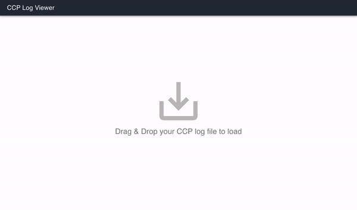

## Components

The log viewer consists of **Metrics**, **Snapshots** and **Log** components.

### 1. Metrics

Metrics visualizes the **skew **recorded in each snapshot, and** API Latency** measured between API request and responses. Other than that, it also displays the agent states as** reference areas. **

These graphs can be turned on/off by click the button on top of the Metrics area. Below is an example for a Metrics area containing all 3 graphs.


* **Skew** is the difference between the client-side (agent's workstation) local timestamp and server-side (Amazon Connect service) timestamp in milliseconds. 

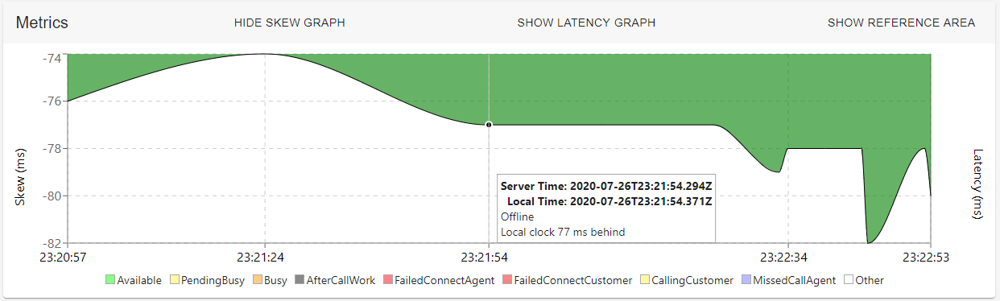

If the skew is positively or negatively too large, it can cause problems in agent's state transitions (*1). Metrics components highlights the graph in red if the values are too large. It can be also seen in the tooltip with ⚠ sign, warns you the skew is too big for this session.

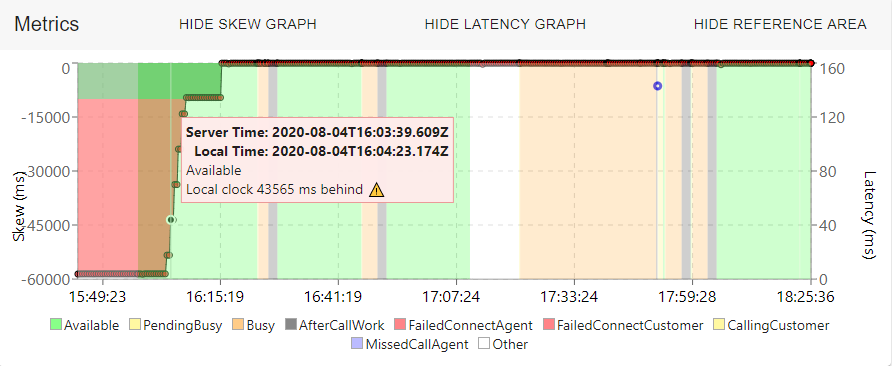

* **Latency graph **shows the time difference between specific API calls and WebSocket heartbeat latencies. It can be a good proof in user's network latency. 

```
Due to the limited information exposed in CCP v1 Logs, latency graph will **only show (% style="color:#e74c3c" %)failed (%%)API requests and it's latency for CCP V1 logs. **CCP V2 logs contains all the API requests' latencies as well as WebSocket heartbeat latencies.
```

Graph below shows the api of ##createOutboundContact ##succeeded after 2064 ms. 

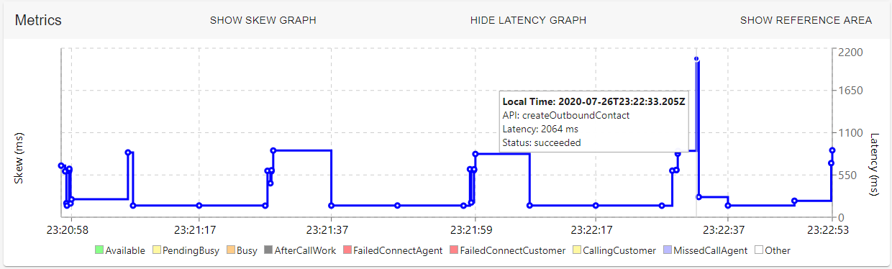

For failed API calls, the tooltip would show the status as Failed. Graph below shows the api of ##createOutboundContact ##failed after 956 ms. 

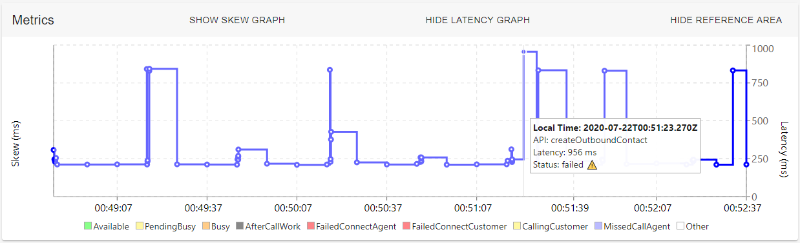

* Reference Area can be used in conjunction with skew/latency graph to grasp how the state transitioned. Hover your mouse at the legend below would highlight the state on the graph. 


### 2. Snapshots

The CCP periodically retrieves an AgentSnapshot from Amazon Connect (*2). An AgentSnapshot contains information such as state, contacts, skew, etc. This component extracts all the snapshots recorded with "GET_AGENT_SNAPSHOT succeeded" message and lists the name of agent's state (i.e. `(% class="inline-code" %)snapshot.state.name(%%)`).

Clicking on one Snapshot highlights the section from that snapshot till the subsequent snapshot.

### 3. Log

Finally the Log part. This component shows each log object in one line so that it looks like a general log file. The format of each line is as follows:

```
<time> <component> <level> <text> 
```

#### 3.1 Filtering log entries

You can filter logs in two ways:

**by keywords**

Enter keywords as a regular expression in "Filter..." input box.

e.g. if you want to filter logs by a Contact ID, simply enter the Contact ID:

```
ee994090-9f56-41d7-a370-d530cec7be9e
```

e.g. use regular expressions such as:

```
[0-9a-z]{8}-[0-9a-z]{4}-[0-9a-z]{4}-[0-9a-z]{4}-[0-9a-z]{12}
```

e.g. use '|' to filter by OR keywords:

```
SESSION|SIGNALING
```

*NOTE there should not be spaces between '|' and keywords

**by log level**

Choose log level from **ERROR**, **WARNING**, **INFO**, **TRACE**, **DEBUG** and **LOG**. Only the logs whose level is higher than or equals to the selected one are shown.


#### 3.2 View log entry

Normally log entries were collapsed. In some cases, the log entry might contain more information, and a plus sign would appear on the left of that log entry. You can always expand or collapse the log lines to see the original log object in JSON format by clicking the plus sign.

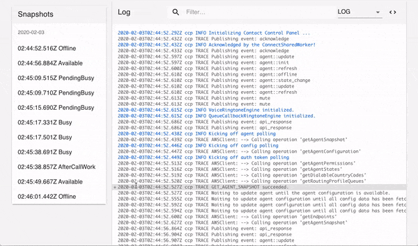

Some log entries were modified for better viewing experience. In that case, the ##_originalText ##object can be found under the log entry when expanded. 

You can also click the expand button `<>` on the right top to expand the log viewer.


## Troubleshooting Guide

### What happens if CCP cannot communicate with ...

Below are the observed behavior and logs of CCP when it cannot communicate with the Signaling Endpoint (TCP/443), Media Endpoint (UDP/3478), and API Endpoint (TCP/443) respectively.

#### Signaling Endpoint Denied

Let's take a look at the behavior when the agent's workstation does not allow outbound TCP/443 only to Signaling Endpoint. In this case, the CCP shows "Initialization Failed" error.

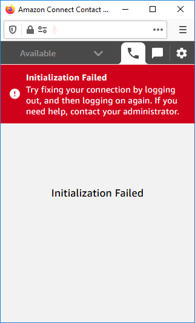

In the CCP logs, there will be INFO level log "Initializing Websocket Manager" repeatedly appearing but no WebSocket connection gets established. There may also be "WebSocketManager Error".

```
2020-10-15T12:56:09.456Z ccp INFO Initializing Websocket Manager
2020-10-15T12:56:09.456Z ccp DEBUG [initWebSocket] Primary WebSocket: CONNECTING | Secondary WebSocket: NULL
2020-10-15T12:56:10.457Z ccp DEBUG Scheduling WebSocket reinitialization, after delay 1489 ms
2020-10-15T12:56:11.946Z ccp INFO Initializing Websocket Manager
2020-10-15T12:56:11.946Z ccp DEBUG [initWebSocket] Primary WebSocket: CONNECTING | Secondary WebSocket: NULL
2020-10-15T12:56:12.945Z ccp DEBUG Scheduling WebSocket reinitialization, after delay 5050 ms
2020-10-15T12:56:17.720Z ccp DEBUG [webSocketOnError] Primary WebSocket: CLOSED | Secondary WebSocket: NULL
2020-10-15T12:56:17.720Z ccp ERROR WebSocketManager Error, error_event:  [object Event]
```

If the outbound traffic is allowed when CCP opens, the initialization succeeds. But even in this case, when you press the [Accept call] button, you cannot initiate the call since the CCP is not able to connect to the signaling endpoint.

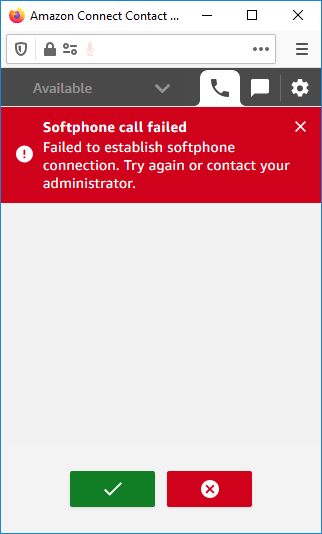

At this time, the CCP log shows the following errors:

```
2020-10-15T12:58:34.344Z ccp INFO Initializing Websocket Manager
2020-10-15T12:58:34.344Z ccp DEBUG [initWebSocket] Primary WebSocket: CONNECTING | Secondary WebSocket: NULL
2020-10-15T12:58:34.596Z softphone INFO 86fed616-d4cc-4f27-84be-039a412806ec SIGNALING PendingAnswerState => FailedState
2020-10-15T12:58:34.597Z softphone ERROR 86fed616-d4cc-4f27-84be-039a412806ec SESSION Failed handshaking with signaling server Timeout
2020-10-15T12:58:34.597Z softphone INFO 86fed616-d4cc-4f27-84be-039a412806ec SESSION InviteAnswerState => FailedState
2020-10-15T12:58:34.597Z softphone ERROR Softphone error occurred :  signalling_handshake_failure Handshaking with Signalling Server wss://rtc.connect-telecom.ap-northeast-1.amazonaws.com/LilyRTC failed.
```

#### Media Endpoint Denied

This is what happens when you cannot connect to Media Endpoint using UDP/3478.
The detection of the Inbound Call is still possible. However, pressing the Accept Call button results in "ice_collection_timeout" error, which shows TURN Server cannot be contacted.

|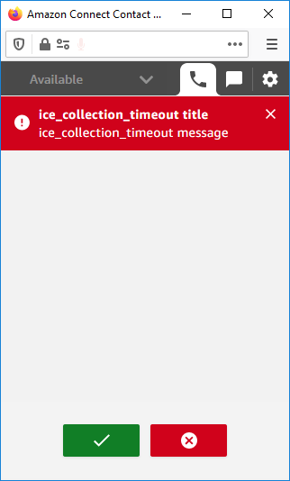|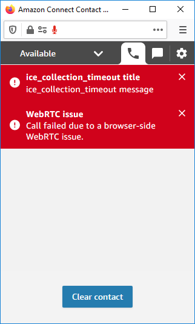|

Errors similar to the following are logged in the CCP Log: I cannot get an ICE candidate and I cannot start the media relay.

```
2020-10-15T13:10:53.234Z softphone WARN 2b89704c-8b69-405b-b39d-9f3c009f971e SESSION ICE collection timed out
2020-10-15T13:10:53.234Z softphone ERROR 2b89704c-8b69-405b-b39d-9f3c009f971e SESSION No ICE candidate
2020-10-15T13:10:53.235Z softphone INFO 2b89704c-8b69-405b-b39d-9f3c009f971e SESSION ConnectSignalingAndIceCollectionState => FailedState
2020-10-15T13:10:53.235Z softphone ERROR Softphone error occurred :  ice_collection_timeout Ice collection timedout.
```

#### Connect API Endpoint Denied

When the CCP cannot connect to Connect API, API calls such as GetAgentSnapshots fail and CCP shows "Initialization Failed" error.

In this case, CCP cannot even detect Incoming Call, and state remains the same until the network connectivity recovers. Agent may become "Missed Call" state as an incoming call in queue can be routed even when the CCP has no connectivity to Connect API.

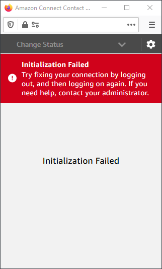

Below are example CCP logs that indicate API calls failures.

```
2020-10-15T13:17:54.202Z ccp TRACE 💬AWSClient: -->  'getAgentSnapshot'
2020-10-15T13:17:54.615Z ccp ERROR Failed to get agent data.
2020-10-15T13:17:54.616Z ccp TRACE ❗ AWSClient: <--  'getAgentSnapshot' failed
```
```
2020-10-15T13:18:10.298Z ccp TRACE 💬AWSClient: -->  'acceptContact'
2020-10-15T13:18:10.477Z ccp ERROR 'acceptContact' API request failed
2020-10-15T13:18:10.477Z ccp ERROR Failed to handle AWS API request for method acceptContact
2020-10-15T13:18:10.479Z ccp TRACE Publishing event: api_response
2020-10-15T13:18:10.480Z ccp ERROR Failed to accept call{"type":"NetworkingError","message":"Network Failure","stack":["handleRequest/<@https://xxx.awsapps.com/connect/ccp-naws/static/streams/connect-streams-min.ab40ee1a.js:1:78756",""]}
```

```
2020-10-15T13:18:14.478Z ccp TRACE 💬AWSClient: -->  'sendSoftphoneCallReport'
2020-10-15T13:18:15.332Z ccp ERROR 'sendSoftphoneCallReport' API request failed
2020-10-15T13:18:15.332Z ccp ERROR Failed to handle AWS API request for method sendSoftphoneCallReport
```